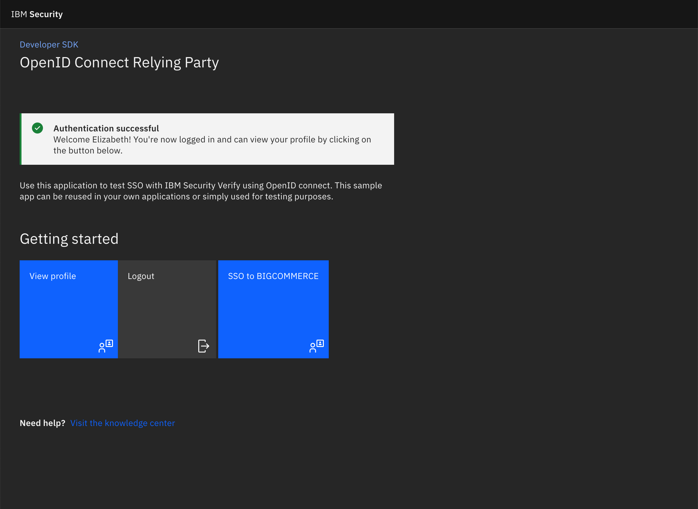
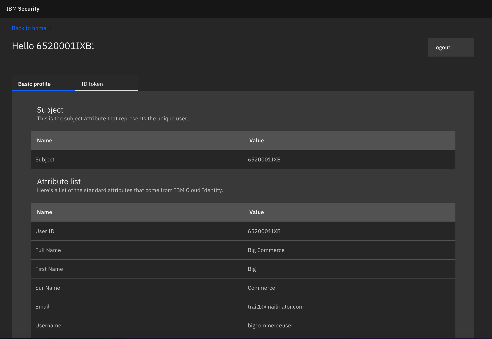
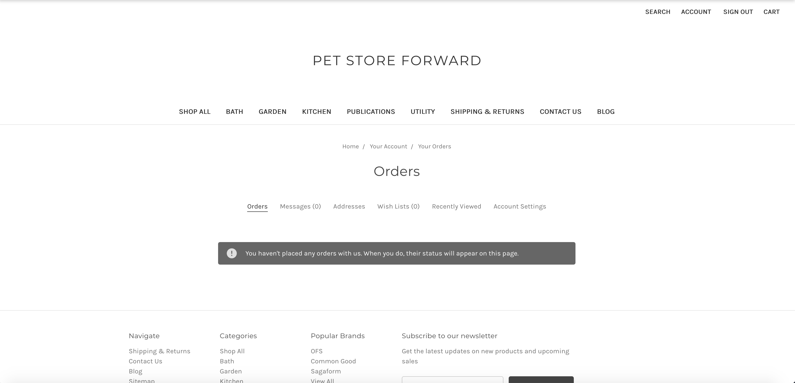

<!-- TOC -->
# Table of contents
- [Overview](#overview)
- [Pre Requisites](#pre-requisites)
- [Setup](#setup)
- [Run the App](#run-the-app)

<!-- /TOC -->

# Overview
Use this application to configure Single Sign On into a Big Commerce Storefront, using OIDC. The custom application is built with Node.js using ExpressJS and PassportJS modules. In this tutorial, you will be able to accomplish:
1.	Authenticating the client using IBM Cloud Identity
2.	Viewing the authenticated user's profile
3.	Dynamically get BC store owner credential, based on callout attribute, and provide dynamic SSO into any BC storefront 
4.	Logging out of the client

Sample Images:







References: 
- [Express.js](https://expressjs.com/) 
- [Passport.js](http://www.passportjs.org/)
- [Passport-OpenIdConnect](https://github.com/jaredhanson/passport-openidconnect)

# Pre Requisites

1. **Install Node and Github**
Configure Node and Github with the following links: [NodeJS](https://nodejs.org/en/download/) & [Git](https://desktop.github.com/)
2. **Create a tenant in Cloud Identity**
Sign up through market place: [IBM Cloud Identity](https://www.ibm.com/us-en/marketplace/cloud-identity)
3. **Clone this repo on your machine**
`git clone https://github.com/eugenetor/CI-OIDC-Sample.git`
4. **Create a Big Commerce Storefront** [Big Commerce](https://www.bigcommerce.com/)

**Note:** If you want to make modifications to the UI, this app is built in the [IBM's Carbon Design System](https://carbondesignsystem.com) using [Vanilla JS](https://the-carbon-components.netlify.com/) patterns.

# Setup

Following the steps below will ensure you will have a working local OIDC application. 

1. **Create an OIDC App in Cloud Identity Connect**
Go to the IBM Cloud Identity portal and create a new application. Choose the custom application option. In Sign-On Method, choose `Open ID Connect 1.0`.

1.1 **Enter the Application URL**
By default the Application URL will listen on localhost port 3000. Enter `http://localhost:3000/` in the input field. 

1.2 **Enter the Redirect URI**
The Redirect URI that we will use is `http://localhost:3000/oauth/callback`. 

1.2.1 **Disable PKCE**

1.3 **Save to Generate Client ID and Secret**
Once you save your application, you will be given the client ID and secret, copy these for use when configuring the OIDC application. 

1.4 **Set Entitlements**
Whether you want to allow one user, a group, or all users to access this application, ensure you set the entitlements to the application via the Entitlements tab.

1.5 (optional) **Social Login**
If you would like to support Social Login, first setup a social provider in Settings -> Identity Sources. Then in your custom application, under Access Policies, choose `specific supported identity sources` and then select your supported social providers.

1.6 **Attribute**
Create an API attribute "BigCommerceId" with a fixed value of NA. Add attribute to attribute mapping in the sign-on tab of your BigCommerce Application. 

2. **Run the install command**
In the Git repo folder that you cloned, run the following command from the terminal to ensure everything is up to date. 

```
npm install
```

3. **Create Big Commerce API Account**
In the BigCommerce Portal, go to advanced settings, API Accounts, create a new API Account. Note the API Path, Client ID, and Client Secret. 

4. **Create the `.env` file**
This is a hidden file in your filesystem within the Git repo folder. Edit it by typing `open .env` if on a mac or use vi on linux. If you are on Windows, you will need to set the variables manually in the JS file or find another solution. 
Edit this file and save it. 
```
OIDC_CI_BASE_URI=https://your-tenant-id.ice.ibmcloud.com/oidc/endpoint/default
OIDC_CLIENT_ID=XXXXXXXX-xxxx-xxxx-xxxx-XXXXXXXXXXXX
OIDC_CLIENT_SECRET=YYYYYYYYYY
OIDC_REDIRECT_URI=http://localhost:3000/oauth/callback
BC_CLIENT_ID=xxxxxxxxxxxxxxxxxxxxxxxxxx
BC_CLIENT_SECRET=xxxxxxxxxxxxxxxxxxxxxxxxxxxxxxxxxxxxxxxxxxxxxxxxxxxxxxxxxxxxxxxx
BC_STORE_HASH= found in API Path url  https://api.bigcommerce.com/stores/xxxxxxxxxx/v3/
BC_STORE_URL=https://store-front-name.mybigcommerce.com
```

# Run the App
To run the app, run the following command via the terminal:
`npm start`

This will open a web server hosted on port 3000 at the folllowing address: http://localhost:3000
